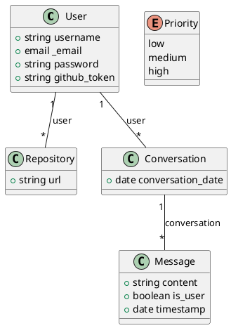

# Diagrama de Domínio

# OraculoApp

## User
Descrição: Classe Sem Descrição
Tabela 1: atributos da entidade User

|Nome|Descrição|Meta Dados|Visibilidade|
|-|-|-|-|
|username||`string min: * max: * unique: false blank: false`|Public|
|_email||`email min: * max: * unique: false blank: false`|Public|
|password||`string min: * max: * unique: false blank: false`|Public|
|github_token||`string min: * max: * unique: false blank: false`|Public|

Autor: Autoria Própria

## Repository
Descrição: Classe Sem Descrição
Tabela 2: atributos da entidade Repository

|Nome|Descrição|Meta Dados|Visibilidade|
|-|-|-|-|
|url||`string min: * max: * unique: false blank: false`|Public|

Autor: Autoria Própria

## Conversation
Descrição: Classe Sem Descrição
Tabela 3: atributos da entidade Conversation

|Nome|Descrição|Meta Dados|Visibilidade|
|-|-|-|-|
|conversation_date||`date min: * max: * unique: false blank: false`|Public|

Autor: Autoria Própria

## Message
Descrição: Classe Sem Descrição
Tabela 4: atributos da entidade Message

|Nome|Descrição|Meta Dados|Visibilidade|
|-|-|-|-|
|content||`string min: * max: * unique: false blank: false`|Public|
|is_user||`boolean min: * max: * unique: false blank: false`|Public|
|timestamp||`date min: * max: * unique: false blank: false`|Public|

Autor: Autoria Própria