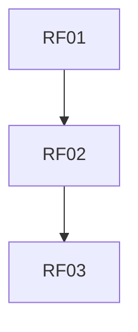

# Requisitos Funcionais
| Item | Descrição | Dependências | Habilitados | Atores |
| --- | --- | --- | --- | --- |
| RF01 | O sistema deve permitir registro de usuários com email e senha |  | RF02 |  |
| RF02 | O sistema deve permitir login seguro de usuários | RF01 | RF03 |  |
| RF07 | O sistema deve padronizar respostas da IA com parâmetros controláveis |  |  |  |
| RF06 | O sistema deve gerar gráficos e visualizações de dados |  |  |  |
| RF05 | O sistema deve manter memória contextual das conversas com a IA |  |  |  |
| RF04 | O sistema deve permitir inserir e atualizar token de acesso ao GitHub |  |  |  |
| RF03 | O sistema deve permitir controle de acesso para que usuários vejam apenas seus próprios dados | RF02 |  |  |


# Requisitos Não Funcionais
| Item | Descrição | Dependências | Habilitados | Atores |
| --- | --- | --- | --- | --- |
| RNF05 | O sistema deve usar LangChain para gerenciamento de memória |  |  |  |
| RNF04 | O frontend deve ser desenvolvido em React |  |  |  |
| RNF03 | O backend deve ser desenvolvido em Django |  |  |  |
| RNF02 | Deve ser uma aplicação responsiva, funcionando bem em desktop e mobile |  |  |  |
| RNF01 | O sistema deve ter autenticação segura com criptografia de senha |  |  |  |


# Regras de Negócio
| Item | Descrição | Dependências | Habilitados | Atores |
| --- | --- | --- | --- | --- |


# Grafos de Dependências

## Requisitos Funcionais



## Requisitos Nao Funcionais

```mermaid
graph TD

```

## Regras de Negócio

```mermaid
graph TD

```