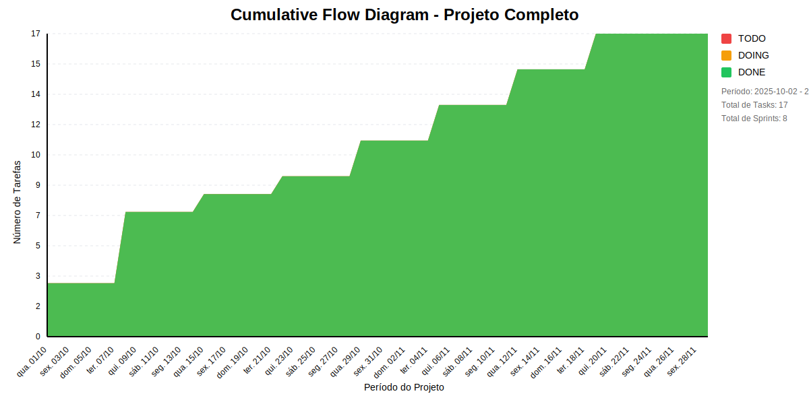

# 📊 Visão Geral do Projeto 

Conversão automática do backlog.md para um arquivo .made contendo Project, Backlog, TimeBoxes (sprints), Roadmap e Milestones.
* Data de Início: 2025-10-02
* Data de Planejado: 2025-11-30
* Data de Finalização: 

Conversão automática do backlog.md para um arquivo .made contendo Project, Backlog, TimeBoxes (sprints), Roadmap e Milestones.
## Métricas Consolidadas

| Sprint | Período | Duração | Total Tasks | Concluídas | Em Progresso | Pendentes | Velocidade | Eficiência |
|--------|---------|----------|-------------|------------|--------------|-----------|------------|------------|
| Sprint 1: Memória Inicial com LangChain | 01/10 - 07/10 | 6 dias | 3 | 3 (100.0%) | 0 | 0 | 0.5/dia | 100.0% |
| Sprint 2: Visualização e Gráficos | 08/10 - 14/10 | 6 dias | 4 | 4 (100.0%) | 0 | 0 | 0.67/dia | 100.0% |
| Sprint 3: Padronização da IA - Parte 1 | 15/10 - 21/10 | 6 dias | 1 | 1 (100.0%) | 0 | 0 | 0.17/dia | 100.0% |
| Sprint 4: Interface e UX | 22/10 - 28/10 | 6 dias | 1 | 1 (100.0%) | 0 | 0 | 0.17/dia | 100.0% |
| Sprint 5: Autenticação Segura | 29/10 - 04/11 | 6 dias | 2 | 2 (100.0%) | 0 | 0 | 0.33/dia | 100.0% |
| Sprint 6: Gerenciamento de Token - Parte 1 | 05/11 - 11/11 | 6 dias | 2 | 2 (100.0%) | 0 | 0 | 0.33/dia | 100.0% |
| Sprint 7: Gerenciamento de Token - Parte 2 | 12/11 - 18/11 | 6 dias | 2 | 2 (100.0%) | 0 | 0 | 0.33/dia | 100.0% |
| Sprint 8: Estabilização e Revisão Final | 19/11 - 29/11 | 10 dias | 2 | 2 (100.0%) | 0 | 0 | 0.2/dia | 100.0% |

## Análise Geral

- **Total de Sprints:** 8
- **Total de Tasks:** 17
- **Taxa de Conclusão:** 100.0%

### Notas
- Período Total: 01/10 - 29/11
- Média de Duração das Sprints: 7 dias

*Última atualização: novembro de 2025*

## Cumulative Flow 

 ## Previsão do Projeto 

## 🎯 Conclusão Principal

### ✅ PROJETO PROVAVELMENTE SERÁ CONCLUÍDO NO PRAZO

- **Probabilidade de conclusão no prazo**: 100.0%
- **Data mais provável de conclusão**: dom., 09/11/2025
- **Dias em relação ao planejado**: -20 dias
- **Status**: ✅ Antes do Prazo

### 📊 Métricas do Projeto

| Métrica | Valor | Status |
|---------|--------|--------|
| Velocidade Atual | 2.1 tarefas/dia | ✅ |
| Velocidade Necessária | 0.0 tarefas/dia | - |
| Dias Restantes | 20 dias | - |
| Tarefas Restantes | 0 tarefas | - |

### 📅 Previsões de Data de Conclusão

| Data | Probabilidade | Status | Observação |
|------|---------------|---------|------------|
| dom., 09/11/2025 | 100.0% | ✅ Antes do Prazo | 📍 Data mais provável |

## 💡 Recomendações

1. ✅ Manter o ritmo atual de 2.1 tarefas/dia
2. ✅ Continuar monitorando impedimentos
3. ✅ Planejar próximas sprints com antecedência

## ℹ️ Informações do Projeto

- **Total de Sprints**: 8
- **Início**: qua., 01/10/2025
- **Término Planejado**: sáb., 29/11/2025
- **Total de Tarefas**: 17
- **Simulações Realizadas**: 10.000

---
*Relatório gerado em 10/11/2025, 10:17:42*