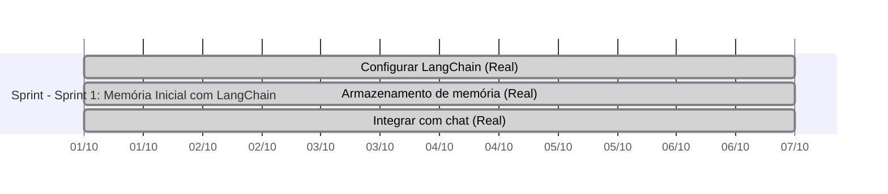
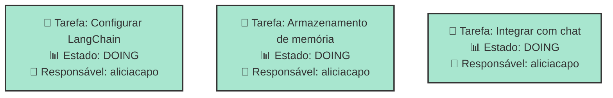
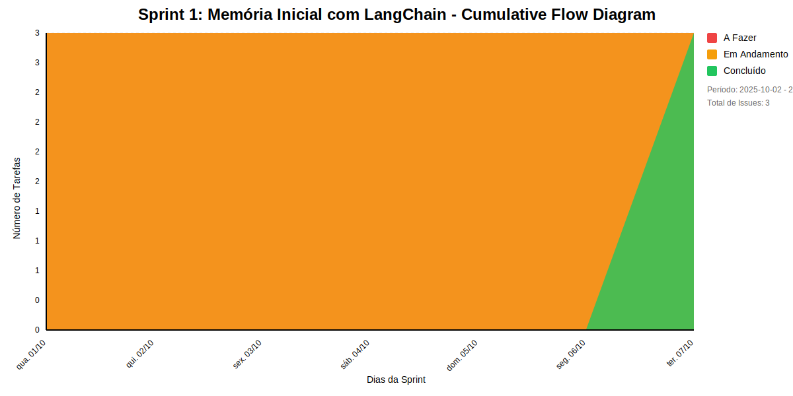
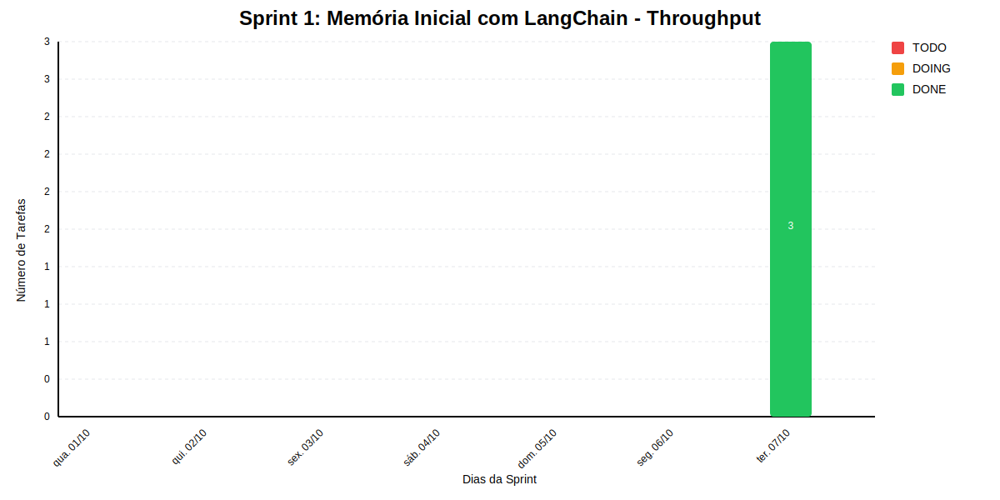

# SPRINT 1: MEMÓRIA INICIAL COM LANGCHAIN

02/10/2025 -- 08/10/2025

## Dados do Sprint
* **Goal**:  02/10/2025 -- 08/10/2025
* **Data Início**: 2025-10-02
* **Data Fim**: 2025-10-08
* **Status**: IN_PROGRESS
## Sprint Backlog

|Nome |Descrição|Resposável |Data de Inicio Planejada| Data de Entrega Planejada| Data de Inicío | Data Entrega | Status|
|:----|:---------|:-------- |:----------------------:| :-----------------------:| :------------: |:------------:|:-----:|
|Configurar LangChain|Instalar e configurar biblioteca|aliciacapo|2025-10-02|2025-10-02|2025-10-02|2025-10-08|DOING|
|Armazenamento de memória|Criar store para histórico|aliciacapo|2025-10-02|2025-10-02|2025-10-02|2025-10-08|DOING|
|Integrar com chat|Usar contexto nas respostas|aliciacapo|2025-10-02|2025-10-02|2025-10-02|2025-10-08|DOING|
     
## Gantt 

# Análise de Dependências do Sprint

Análise gerada em: 10/11/2025, 10:17:42

## 🔍 Grafo de Dependências

**Legenda:**
- 🟢 Verde Claro: Issues no sprint
- 🟢 Verde Escuro: Issues concluídas
- 🟡 Laranja: Dependências externas ao sprint
- ➡️ Linha sólida: Dependência no sprint
- ➡️ Linha pontilhada: Dependência externa

## 📋 Sugestão de Execução das Issues

| # | Título | Status | Responsável | Dependências |
|---|--------|--------|-------------|---------------|
| 1 | Configurar LangChain | DOING | aliciacapo | 🆓 |
| 2 | Armazenamento de memória | DOING | aliciacapo | 🆓 |
| 3 | Integrar com chat | DOING | aliciacapo | 🆓 |

**Legenda das Dependências:**
- 🆓 Sem dependências
- ✅ Issue concluída
- ⚠️ Dependência externa ao sprint

            
## Cumulative Flow

## Throughput

        
# Previsão da Sprint

## ✅ SPRINT PROVAVELMENTE SERÁ CONCLUÍDA NO PRAZO

- **Probabilidade de conclusão no prazo**: 100.0%
- **Data mais provável de conclusão**: qua., 12/11/2025
- **Dias em relação ao planejado**: 36 dias
- **Status**: ❌ Atraso Crítico

### 📊 Métricas Críticas

| Métrica | Valor | Status |
|---------|--------|--------|
| Velocidade Atual | 1.0 tarefas/dia | ❌ |
| Velocidade Necessária | 3.0 tarefas/dia | - |
| Dias Restantes | 1 dias | - |
| Tarefas Restantes | 3 tarefas | - |

### 📅 Previsões de Data de Conclusão

| Data | Probabilidade | Status | Observação |
|------|---------------|---------|------------|
| qua., 12/11/2025 | 100.0% | ❌ Atraso Crítico | 📍 Data mais provável |

### 📋 Status das Tarefas

| Status | Quantidade | Porcentagem |
|--------|------------|-------------|
| Concluído | 0 | 0.0% |
| Em Andamento | 3 | 100.0% |
| A Fazer | 0 | 0.0% |

## 💡 Recomendações

1. ✅ Mantenha o ritmo atual de 1.0 tarefas/dia
2. ✅ Continue monitorando impedimentos
3. ✅ Prepare-se para a próxima sprint

## ℹ️ Informações da Sprint

- **Sprint**: Sprint 1: Memória Inicial com LangChain
- **Início**: qua., 01/10/2025
- **Término Planejado**: ter., 07/10/2025
- **Total de Tarefas**: 3
- **Simulações Realizadas**: 10.000

---
*Relatório gerado em 10/11/2025, 10:17:42*
        