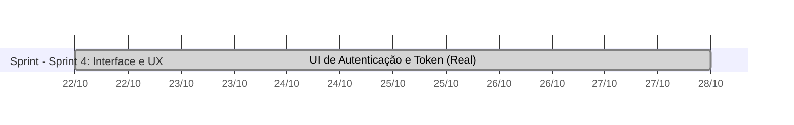
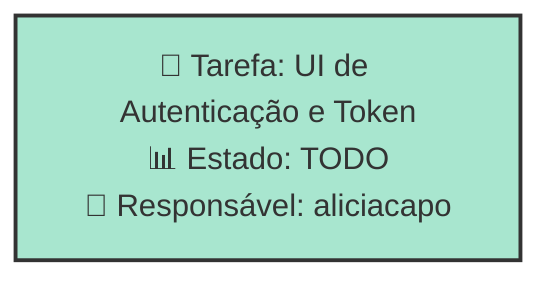
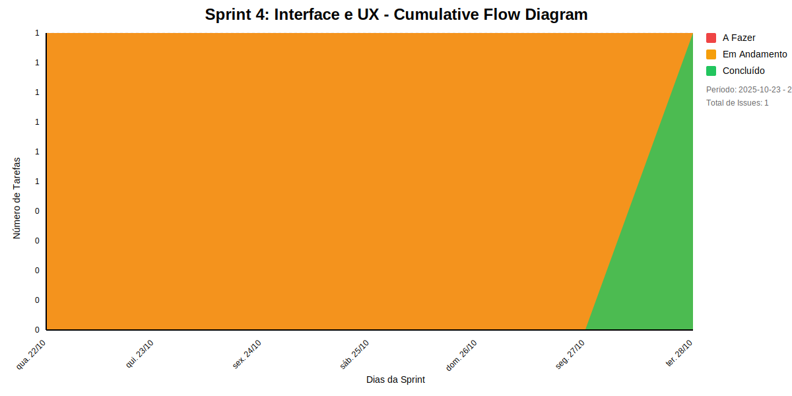
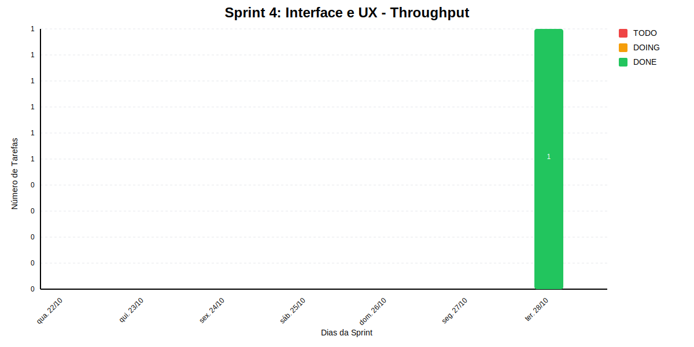

# SPRINT 4: INTERFACE E UX

23/10/2025 -- 29/10/2025

## Dados do Sprint
* **Goal**:  23/10/2025 -- 29/10/2025
* **Data Início**: 2025-10-23
* **Data Fim**: 2025-10-29
* **Status**: PLANNED
## Sprint Backlog

|Nome |Descrição|Resposável |Data de Inicio Planejada| Data de Entrega Planejada| Data de Inicío | Data Entrega | Status|
|:----|:---------|:-------- |:----------------------:| :-----------------------:| :------------: |:------------:|:-----:|
|UI de Autenticação e Token|Criar telas de login, cadastro e gerenciamento de token com design responsivo|aliciacapo|2025-10-23|2025-10-23|2025-10-23|2025-10-29|TODO|
     
## Gantt 

# Análise de Dependências do Sprint

Análise gerada em: 10/11/2025, 10:17:42

## 🔍 Grafo de Dependências

**Legenda:**
- 🟢 Verde Claro: Issues no sprint
- 🟢 Verde Escuro: Issues concluídas
- 🟡 Laranja: Dependências externas ao sprint
- ➡️ Linha sólida: Dependência no sprint
- ➡️ Linha pontilhada: Dependência externa

## 📋 Sugestão de Execução das Issues

| # | Título | Status | Responsável | Dependências |
|---|--------|--------|-------------|---------------|
| 1 | UI de Autenticação e Token | TODO | aliciacapo | 🆓 |

**Legenda das Dependências:**
- 🆓 Sem dependências
- ✅ Issue concluída
- ⚠️ Dependência externa ao sprint

            
## Cumulative Flow

## Throughput

        

        